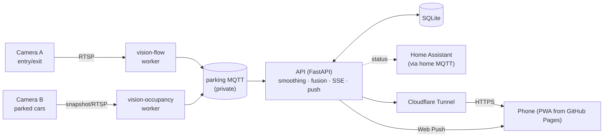
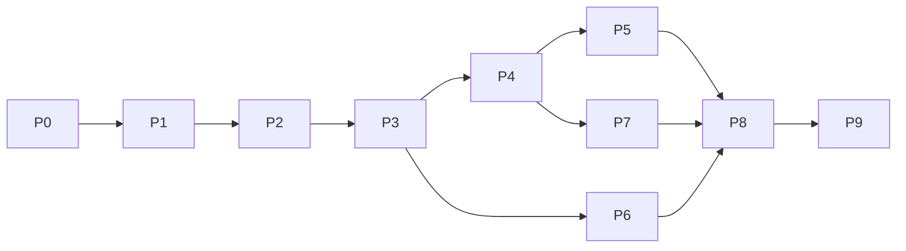

# Parking App — Plan (overview)

> This is the **overview**. The details are split into focused documents:
> - **[docs/design/](docs/design/)**: specs (contracts, formats, algorithms). The source of truth.
> - **[docs/phases/](docs/phases/)**: step-by-step guides with numbered tasks (`P1.5` …).
> - **[PROGRESS.md](PROGRESS.md)**: what's done and what's next.
>
> Start at [docs/README.md](docs/README.md) for the index and conventions.

## 1. Goal

A mobile-friendly web app that shows **how many parking spaces are free, in real time**, based on one or two fixed cameras. The lot has **two levels: ground and underground**.

| # | Feature | Details |
|---|---------|---------|
| F1 | Live free-space count, total and per level | [frontend.md](docs/design/frontend.md) |
| F2 | Continuous camera analysis (starting from a single still image) | [vision.md](docs/design/vision.md) |
| F3 | Camera A counts cars **in/out**; Camera B counts cars **parked** | [vision.md §2, §7](docs/design/vision.md) |
| F4 | Mobile web UI, installable to the home screen (PWA) | [frontend.md](docs/design/frontend.md) |
| F5 | "You're close" notification with the free count | [notifications.md](docs/design/notifications.md) |

**Not in scope:** reservations, payments, licence-plate recognition, identifying people.

## 2. Starting point

| Item | State |
|------|-------|
| Repo | `iulian-redinciuc/parking-app`, **public** (so: no camera images or secrets in git, see [security-privacy.md §3](docs/design/security-privacy.md#3-public-repo-rules)) |
| Hosting | GitHub Pages: https://iulian-redinciuc.github.io/parking-app/ |
| Server | Raspberry Pi 5, 8 GB RAM, NVMe. Docker, Node 22, Python 3.13. Shared with other services, so the parking stack gets a limited CPU/RAM budget |
| Cameras | None yet. Phase 1 uses a still image |

## 3. Architecture

Workers turn frames into **small JSON results** (never images) → the API smooths and combines them into per-level counts → phones get live updates over **Server-Sent Events** and notifications over **Web Push**.
Full detail: [architecture.md](docs/design/architecture.md).

## 4. Stack (summary)

| Area | Choice | Why (short) |
|------|--------|-------------|
| Vision | Python 3.12, **YOLO11n / YOLO11n-seg** (NCNN on the Pi CPU), ByteTrack, OpenCV, shapely | Best speed/accuracy on a Pi 5; tracking built in. AGPL licence noted, and the detector is swappable |
| Backend | **FastAPI**, SSE, SQLite + Alembic, APScheduler, pywebpush | Async, simple, one language with vision |
| Messaging | **Dedicated Mosquitto** in the parking stack (auth + ACL, internal network); an optional Home Assistant broker gets status only | Counts must only be writable by our own authenticated workers |
| Frontend | **Vite + React + TS + Tailwind + vite-plugin-pwa**, HashRouter, i18next | Large ecosystem; static build for Pages |
| Hosting | Frontend on **GitHub Pages** (Actions); API on the Pi through **Cloudflare Tunnel** (or Tailscale Funnel) | Free HTTPS, no open router ports |
| Packaging | **Docker Compose** (`api` image without PyTorch, `vision` image with it) | Matches how the Pi is already run |
| Optional | AI HAT+ (Hailo) for the flow camera; Capacitor for native geofencing | Only if needed |

Alternatives and reasons: [architecture.md](docs/design/architecture.md), [deployment.md](docs/design/deployment.md).

## 5. Key design decisions

1. **Camera layout.** Recommended **Option A**: Camera A on the underground ramp (in/out counting), Camera B over the ground level (per-space detection). Options B and C are in [vision.md §1–2](docs/design/vision.md) and need your input.
2. **Space detection.** Vehicle masks overlapping hand-drawn space polygons, with a per-space classifier as a fallback ([vision.md §2, §9](docs/design/vision.md)).
3. **Entry/exit.** Tracking plus **two counting lines**, so cars that stop or reverse aren't miscounted. Drift is handled by admin corrections, an optional nightly reset, and a "≈" display ([vision.md §7–8](docs/design/vision.md)).
4. **No silent failures.** Stale data and low confidence are always visible in the UI ([frontend.md §2.1](docs/design/frontend.md)).
5. **Notifications.** A website can't watch location in the background, so there are tiers: proximity while open, "I'm on my way", schedules, the Home Assistant geofence, and an optional native app later ([notifications.md](docs/design/notifications.md)).
6. **Privacy.** Frames are processed in memory and discarded; only numbers are public; location is computed on the phone ([security-privacy.md](docs/design/security-privacy.md)).

## 6. Roadmap

| Phase | Guide | Outcome | Hardware? |
|-------|-------|---------|-----------|
| 0 | [Foundations](docs/phases/phase-0-foundations.md) | Skeleton, CI, secret scanning, inputs collected | No |
| 1 | [Still-image PoC](docs/phases/phase-1-still-image.md) ⭐ | One image → correct free count, annotated | No |
| 2 | [Backend + simulated feed](docs/phases/phase-2-backend.md) | Worker → MQTT → API → SSE end to end | No |
| 3 | [Mobile web app](docs/phases/phase-3-frontend.md) | Live numbers on your phone, installable | No |
| 4 | [Live occupancy camera](docs/phases/phase-4-occupancy-camera.md) | Real Camera B, ≥ 97% accuracy | Camera B |
| 5 | [Entry/exit camera](docs/phases/phase-5-flow-camera.md) | In/out counting, ≤ 2 cars/day drift | Camera A |
| 6 | [Notifications](docs/phases/phase-6-notifications.md) | Push + proximity tiers | No |
| 7 | [Admin + stats](docs/phases/phase-7-admin-stats.md) | Fix things from the phone; history and forecast | No |
| 8 | [Hardening](docs/phases/phase-8-hardening.md) | Unattended, backed up, secure, documented | — |
| 9 | [Extras](docs/phases/phase-9-extras.md) | Native app, slot map, special spaces… | Depends |

Phases 1–3 need no camera hardware; Phase 6 can run alongside 4–5.

## 7. Risks (top)

| Risk | Mitigation |
|------|-----------|
| Bad camera angle (cars hide each other) | Mount high; per-space classifier; a second camera ([hardware.md](docs/design/hardware.md)) |
| Night or underground lighting | IR/low-light camera, lighting, tuning on night images |
| Flow-count drift | Two-line logic, corrections, scheduled reset, "≈" display; Option C if budget allows |
| No background location on the web | Notification tiers; native app later |
| iPhone push needs a home-screen install | Detect it and show instructions |
| Pi overloaded (shared with other services) | Motion gating, resource limits, AI HAT+ |
| Secrets or images leaked to the public repo | `.gitignore`, gitleaks, GitHub push protection |
| AGPL (Ultralytics) if commercial | Detector interface; swap to YOLOX or buy a licence |
| GDPR / CCTV rules | Counts only, no stored frames, signage, privacy page |

## 8. Open questions

Tracked in [PROGRESS.md → Open questions](PROGRESS.md#open-questions). The most important for starting: **the sample image**, **where the lot is relative to the Pi**, **spaces per level**, and **camera layout (A/B/C)**.
