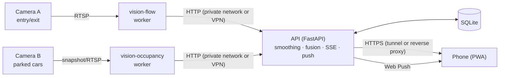
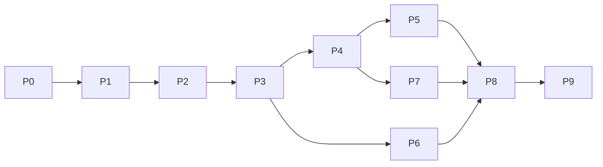

# Parking App — Plan (overview)

> This is the **overview**. The details are split into focused documents:
> - **[docs/design/](docs/design/)**: specs (contracts, formats, algorithms). The source of truth.
> - **[docs/phases/](docs/phases/)**: step-by-step guides with numbered tasks (`P1.5` …).
> - **[PROGRESS.md](PROGRESS.md)**: what's done and what's next.
>
> Start at [docs/README.md](docs/README.md) for the index and conventions.

## 1. Goal

A mobile-friendly web app that shows **how many parking spaces are free, in real time**, based on one or two fixed cameras. The lot has **two levels: ground and underground**.

| # | Feature | Details |
|---|---------|---------|
| F1 | Live free-space count, total and per level | [frontend.md](docs/design/frontend.md) |
| F2 | Continuous camera analysis (starting from a single still image) | [vision.md](docs/design/vision.md) |
| F3 | Camera A counts cars **in/out**; Camera B counts cars **parked** | [vision.md §2, §7](docs/design/vision.md) |
| F4 | Mobile web UI, installable to the home screen (PWA) | [frontend.md](docs/design/frontend.md) |
| F5 | "You're close" notification with the free count | [notifications.md](docs/design/notifications.md) |

**Web app only.** No native or app-store app.

**Not in scope:** native apps, reservations, payments, licence-plate recognition, identifying people.

## 2. Environments: development vs production

| | **Development / testing** | **Production** |
|---|---|---|
| Machine | Iulian's **Raspberry Pi 5** (8 GB, ARM64, CPU only) | **The cloud or another Raspberry Pi** (exact setup chosen before real cameras go in, Phase 4); deployed in Phase 8 |
| Purpose | Build and test everything; run the still-image, replay-feed and recorded-clip tests | Run the real system for real users |
| Rules | The app is **isolated** from everything else on the Pi: own containers, networks and data; nothing existing is used or changed ([deployment.md §1](docs/design/deployment.md#1-development-on-the-raspberry-pi)) | Its own dedicated environment |
| Frontend | **Preview** on GitHub Pages: https://iulian-redinciuc.github.io/parking-app/ | Served by the production server's reverse proxy, same origin as the API (chosen in P8.3, [deployment.md §6](docs/design/deployment.md#6-frontend-hosting)) |

Because production is undecided, the design is **portable**:
- Docker images are built for both **x86-64** (normal PCs, servers, cloud) and **ARM64** (Pi-class boards), so the same release runs anywhere with Docker.
- The **AI runtime is chosen per machine** (NCNN on ARM CPUs like the dev Pi; OpenVINO on Intel CPUs; CUDA/TensorRT on NVIDIA; Hailo on a Pi with an AI HAT+). It's a config setting, not a code change.
- **Speed numbers measured on the dev Pi are a worst case.** They are measured again on the production hardware.
- **Production layouts** to choose from ([deployment.md §3](docs/design/deployment.md#3-production-topologies-to-be-chosen)): one Raspberry Pi at the lot doing everything; **recommended** a Raspberry Pi at the lot for the cameras plus a cloud server for the API; or everything in the cloud. **Chosen in P4.1: the Pi at the lot + a cloud server (T2)**, hardware in [hardware.md §4.5](docs/design/hardware.md#45-chosen-in-p41-to-order).

## 3. Architecture

Workers turn frames into **small JSON results** (never images) → the API smooths and combines them into per-level counts → phones get live updates over **Server-Sent Events** and notifications over **Web Push**. Workers and the API can run on the same machine or on different ones.
Full detail: [architecture.md](docs/design/architecture.md).

## 4. Stack (summary)

| Area | Choice | Why (short) |
|------|--------|-------------|
| Vision | Python 3.12, **YOLO11n / YOLO11n-seg**, ByteTrack, OpenCV, shapely; **runtime per machine** (NCNN / OpenVINO / ONNX Runtime / CUDA / Hailo) | Strong speed/accuracy on small hardware; tracking built in. AGPL licence noted, and the detector is swappable |
| Backend | **FastAPI**, SSE, SQLite + Alembic, APScheduler, pywebpush | Async, simple, one language with vision |
| Worker → API | **Plain HTTP** with a worker token; private Docker network on one machine, VPN between machines; no message broker | Simplest option that works on one machine or several |
| Frontend | **Vite + React + TS + Tailwind + vite-plugin-pwa**, HashRouter, i18next | Large ecosystem; static build that any web host can serve |
| Hosting | **Dev:** API on the Pi; frontend preview on GitHub Pages. **Production:** Caddy on the cloud server: HTTPS, the API and the frontend on one origin (P8.3) | One public listener and one certificate; no extra hosting account |
| Packaging | **Docker Compose** + **multi-arch images** (amd64 + arm64) published to GitHub's container registry | The same release runs on the dev Pi and on any production machine |
| Optional | A hardware AI accelerator for the flow camera (e.g. an AI HAT+ on a production Pi) | Only if needed |

Alternatives and reasons: [architecture.md](docs/design/architecture.md), [deployment.md](docs/design/deployment.md).

## 5. Key design decisions

1. **Camera layout.** Working assumption **Option A**: Camera A on the underground ramp (in/out counting), Camera B over the ground level (per-space detection). Options B and C are in [vision.md §1–2](docs/design/vision.md). The sample photo's straight-down view is **not** the final camera; the real position is chosen in Phase 4.
2. **Space detection.** Chosen per camera: vehicle masks overlapping hand-drawn space polygons for angled views; for straight-down views (like the sample photo) the **MVP** scores each space by how much it differs from empty pavement, to be replaced by a trained per-space classifier once the real camera gives enough photos ([vision.md §2, §2.1, §9](docs/design/vision.md)).
3. **Entry/exit.** Tracking plus **two counting lines**, so cars that stop or reverse aren't miscounted. Drift is handled by admin corrections, an optional nightly reset, and a "≈" display ([vision.md §7–8](docs/design/vision.md)).
4. **No silent failures.** Stale data and low confidence are always visible in the UI ([frontend.md §2.1](docs/design/frontend.md)).
5. **Notifications.** A website can't watch location in the background, and this is **web only**, so there are three tiers: a proximity alert while the app is open, "I'm on my way" pushes, and scheduled pushes ([notifications.md](docs/design/notifications.md)).
6. **Privacy.** Frames are processed in memory and discarded; only numbers are public; location is computed on the phone ([security-privacy.md](docs/design/security-privacy.md)).
7. **Portable by default.** Nothing in the code assumes the Raspberry Pi. Machine-specific choices (AI runtime, CPU limits, public entry point) are configuration ([deployment.md](docs/design/deployment.md)).

## 6. Roadmap

### MVP
**The MVP is Phases 0–3:** a phone web app showing the live number of free spaces, fed by a simulated camera that replays the sample photo, end to end (vision → API → live updates → installable web app). It uses only what exists today: one straight-down sample photo, the dev Pi, and working assumptions for the open questions. It needs **no input from Iulian**: technical choices are made and recorded in the decision log as the work goes.

**Build order** (the agent loop follows PROGRESS.md top to bottom): MVP (0 → 1 → 2 → 3), then the phases that need no hardware (6 notifications, 7 admin + stats), then the ones that need the real cameras or production machines (4, 5, 8; their software parts are built against recordings and simulations, and only the on-site checks wait for hardware), then 9.

| Phase | Guide | Outcome | Runs on | Hardware? |
|-------|-------|---------|---------|-----------|
| 0 | [Foundations](docs/phases/phase-0-foundations.md) | Skeleton, CI, secret scanning, inputs collected | dev Pi | No |
| 1 | [Still-image PoC](docs/phases/phase-1-still-image.md) ⭐ | One image → correct free count, annotated | dev Pi | No |
| 2 | [Backend + simulated feed](docs/phases/phase-2-backend.md) | Worker → API → SSE end to end | dev Pi | No |
| 3 | [Mobile web app](docs/phases/phase-3-frontend.md) | Live numbers on your phone, installable (preview) | dev Pi + Pages preview | No |
| 4 | [Live occupancy camera](docs/phases/phase-4-occupancy-camera.md) | Production layout chosen; real Camera B, ≥ 97% accuracy | dev Pi (recordings) + vision host at the lot | Camera B, vision host |
| 5 | [Entry/exit camera](docs/phases/phase-5-flow-camera.md) | In/out counting, ≤ 2 cars/day drift | dev Pi (recordings) + vision host at the lot | Camera A |
| 6 | [Notifications](docs/phases/phase-6-notifications.md) | Push + proximity tiers | dev Pi + Pages preview | No |
| 7 | [Admin + stats](docs/phases/phase-7-admin-stats.md) | Fix things from the phone; history and forecast | dev Pi | No |
| 8 | [Production deployment + hardening](docs/phases/phase-8-hardening.md) | Deployed to production; unattended, backed up, secure, documented | production | Production machines |
| 9 | [Extras](docs/phases/phase-9-extras.md) | Slot map, special spaces, multiple lots… | — | Depends |

Phases 1–3 (the MVP), 6 and 7 need no camera hardware, so they're built first. Phases 4, 5 and 8 need the real cameras and production machines for their final checks.

## 7. Risks (top)

| Risk | Mitigation |
|------|-----------|
| Bad camera angle (cars hide each other) | Mount high; per-space classifier; a second camera ([hardware.md](docs/design/hardware.md)) |
| Straight-down view: off-the-shelf detectors don't recognise cars from above (seen on the sample photo) | MVP appearance scoring ([vision.md §2.1](docs/design/vision.md)); angled real camera or the trained per-space classifier later |
| Night or underground lighting | IR/low-light camera, lighting, tuning on night images |
| Flow-count drift | Two-line logic, corrections, scheduled reset, "≈" display; Option C if budget allows |
| No background location on the web (web app only) | "I'm on my way" and scheduled pushes work with the app closed; the proximity alert works while it's open; the UI explains this |
| iPhone push needs a home-screen install | Detect it and show instructions |
| Something works on the dev Pi but not in production (different CPU type, network, speed) | Multi-arch images built and tested in CI for both CPU types; benchmarks and evaluation re-run on production hardware (P8.2); a staging run before go-live |
| Production machine too slow for the flow camera | Measure early (Phase 5 recordings on the candidate hardware); motion gating; accelerator for that machine |
| Secrets or images leaked to the public repo | `.gitignore`, gitleaks, GitHub push protection |
| AGPL (Ultralytics) if commercial | Detector interface; swap to YOLOX or buy a licence |
| GDPR / CCTV rules | Counts only, no stored frames, signage, privacy page |

## 8. Open questions

Tracked in [PROGRESS.md → Open questions](PROGRESS.md#open-questions). **None of them block the MVP**: undecided ones use the working assumptions recorded there. Needed only later: the real camera position (Phase 4) and where production runs (Phase 8).
