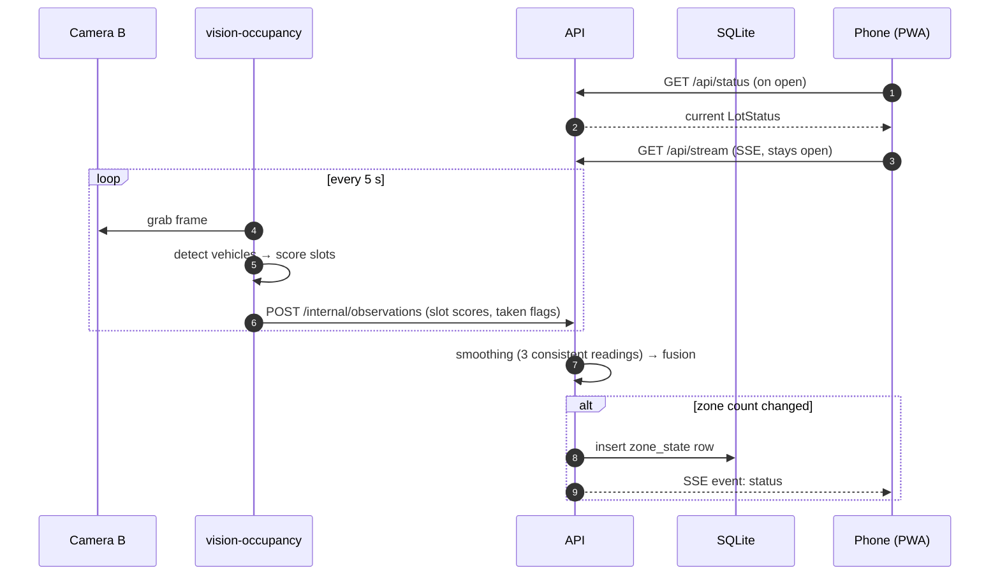
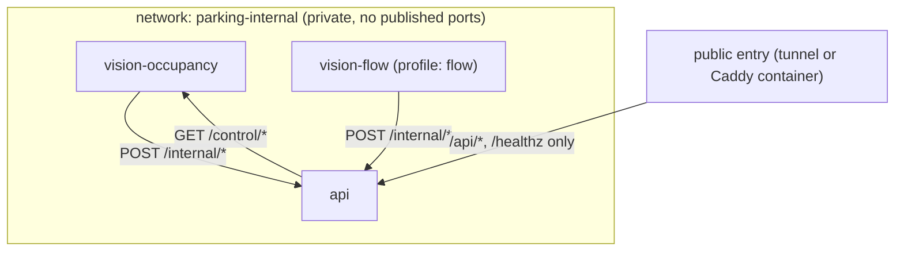

# Architecture

## 0. Environments and isolation

- **Development / testing** happens on Iulian's **Raspberry Pi 5**. There the app is **completely self-contained**: it does **not** use, connect to, or change anything already installed on the Pi. Everything runs in its **own Docker Compose project** (`parking`), on its **own Docker networks**, with its **own data** under this repo folder ([deployment.md §1](deployment.md#1-development-on-the-raspberry-pi)).
- **Production** runs **somewhere else, not decided yet** ([deployment.md §3](deployment.md#3-production-topologies-to-be-chosen)). Nothing in the code may assume the Pi: CPU type, AI runtime, resource limits and public entry are all configuration.

## 1. Components

| Component | Runs where | Responsibility | Talks to |
|-----------|-----------|----------------|----------|
| **vision-occupancy** worker | Dev: Pi. Prod: vision host (at the lot, or cloud in T3) | Grabs frames from Camera B, detects vehicles, scores each space, sends results to the API | Camera (RTSP/HTTP) → API (HTTP, internal) |
| **vision-flow** worker | Dev: Pi. Prod: vision host | Reads Camera A's sub-stream, detects + tracks vehicles, sends in/out events to the API | Camera (RTSP) → API (HTTP, internal) |
| **API** | Dev: Pi. Prod: lot box (T1) or server/VM (T2/T3) | Receives worker results, smoothing, flow counting, fusion into zone counts, SQLite history, REST + SSE, Web Push, admin | workers, SQLite, phones (through tunnel), push services |
| **SQLite** | Same machine as the API, file in `data/db/` | History, subscriptions, corrections | API only |
| **Public entry** | Same machine as the API: its own `parking-tunnel` container, or a `parking-caddy` reverse proxy | Public HTTPS hostname for the API; forwards only `/api/*` and `/healthz` | API |
| **Frontend (PWA)** | Dev: GitHub Pages preview. Prod: decided in Phase 8 | Live screen, notifications settings, stats, admin | API over HTTPS |

## 2. Data flow



Flow camera events follow the same path: `POST /internal/flow-events` → API `FlowCounter` → fusion → SSE.

## 3. Ground rules

1. **Workers never send images** to the API, except a single JPEG an admin asks for (`GET /control/snapshot` on the worker). Results are small JSON.
2. **The API is the only writer** to SQLite and the only component the internet can reach. Its `/internal/*` routes need the worker token **and** are blocked at the tunnel (see [deployment.md §5](deployment.md#5-public-access-for-the-api)).
3. **Configuration is file-based** (`config/lot.yaml` + `config/slots/*.json`), committed to git. **Secrets and the lot location come from `.env`** (git-ignored).
4. **Time is UTC** everywhere in storage and payloads (ISO 8601 with `Z`). Only the UI converts to local time.
5. **Pixel coordinates** in slot and line files are relative to the reference image size stored in that file. Workers rescale if the live frame size differs.
6. **Every payload has a version field `v`** so it can evolve.
7. **Workers are stateless** apart from short-term buffers. All counting state that must survive a restart (flow counts, smoothing results) lives in the API and is persisted.
8. **Fail visible, not silent.** If data is old or a camera is unhealthy, the UI says so (see `stale` and `confidence` in [api.md](api.md#lotstatus)).

## 4. Backend module map (`backend/parking/`)

```
backend/
├── pyproject.toml
├── alembic.ini
├── migrations/                  # Alembic migrations (from Phase 2)
├── parking/
│   ├── __init__.py              # __version__
│   ├── cli.py                   # Typer app: `parking ...` (all commands, see §6)
│   ├── config.py                # pydantic models for lot.yaml, slot/line files, Settings (.env)
│   ├── geometry.py              # polygon/line helpers on top of shapely + numpy
│   ├── messages.py              # pydantic payload models shared by workers and API
│   ├── vision/
│   │   ├── detector.py          # Detection dataclass, Detector protocol, YoloDetector
│   │   ├── occupancy.py         # slot scoring, zone counting
│   │   ├── flow.py              # TwoLineCounter (per-track crossing state machine)
│   │   ├── tracking.py          # wrapper around ByteTrack (via ultralytics)
│   │   ├── motion.py            # MotionGate (MOG2)
│   │   ├── sources.py           # FrameSource protocol + file/folder/snapshot/rtsp/video sources
│   │   ├── recording.py         # `parking record` (FFmpeg stream copy) + `stream-check` fps stats
│   │   ├── health.py            # black / frozen / blurry frame checks
│   │   ├── shift.py             # camera shift detection vs reference frame (ORB)
│   │   ├── annotate.py          # draw slots, detections, lines, totals on a frame
│   │   ├── lines.py             # line-file checks + A/B/IN overlay (`parking lines-check`)
│   │   ├── motion.py            # MotionGate (MOG2 on the ROI, 2 s hold-over) + `motion-check` stats
│   │   ├── bootstrap.py         # propose slots from detections
│   │   └── evaluate.py          # metrics for occupancy and flow
│   ├── workers/
│   │   ├── base.py              # loop, health messages, graceful shutdown, SIGUSR1 freeze (watchdog test)
│   │   ├── heartbeat.py         # loop heartbeat file + `python -m parking.workers.heartbeat` (Docker healthcheck)
│   │   ├── api_client.py        # HTTP client to the API: retries, outbox for flow events
│   │   ├── control.py           # tiny internal HTTP server: /control/snapshot, /reload, /save-reference
│   │   ├── occupancy_worker.py
│   │   └── flow_worker.py
│   ├── core/
│   │   ├── smoothing.py         # SlotSmoother, CountSmoother
│   │   ├── flow_counter.py      # FlowCounter (clamp, corrections, idempotency)
│   │   ├── drift.py             # drift test notes + cars/day verdict (P5.11)
│   │   ├── fusion.py            # StateStore → LotStatus (confidence, stale, trend, level)
│   │   └── clock.py             # injectable clock for tests
│   ├── db/
│   │   ├── engine.py            # SQLModel engine/session (WAL mode)
│   │   ├── models.py            # tables (see data-model.md)
│   │   ├── repo.py              # read/write helpers
│   │   ├── rollups.py           # zone_minute / zone_hour rollups, pruning, retention report
│   │   └── history.py           # /api/history and /api/forecast reads
│   ├── api/
│   │   ├── app.py               # create_app(): routers, CORS, rate limits, lifespan
│   │   ├── deps.py              # settings, db session, state store, auth dependencies
│   │   ├── sse.py               # Broadcaster (fan-out to SSE clients)
│   │   ├── ingest.py            # applies worker payloads to core/, records changes, broadcasts
│   │   ├── cache.py             # 60 s in-memory cache for history / forecast
│   │   └── routes/
│   │       ├── public.py        # /healthz, /api/lot, /api/status, /api/stream, /api/history, /api/forecast
│   │       ├── internal.py      # /internal/* (worker token only)
│   │       ├── push.py          # /api/push/*
│   │       └── admin.py         # /api/admin/*
│   └── push/
│       ├── sender.py            # pywebpush wrapper, expiry cleanup
│       ├── payload.py           # push payload (api.md §6) from the current status
│       ├── rules.py             # when to notify (on-my-way, schedules, quiet hours, almost full)
│       ├── dispatch.py          # shared ingest-hook plumbing + one payload per (lang, tz, zones)
│       ├── on_my_way.py         # Tier 2 dispatch on every status change (ingest hook)
│       └── scheduler.py         # APScheduler reminder job + almost-full ingest hook
└── tests/
    ├── unit/
    ├── integration/
    └── fixtures/                # synthetic images and JSON only (public repo!)
```

## 5. Frontend module map (`frontend/src/`)

```
frontend/
├── index.html
├── vite.config.ts               # base: '/parking-app/', PWA plugin (injectManifest)
├── public/icons/                # PWA icons
└── src/
    ├── main.tsx                 # root, HashRouter, i18n init, SW registration
    ├── App.tsx                  # layout: header, bottom nav, routes
    ├── sw.ts                    # service worker: precache + push + notificationclick
    ├── api/
    │   ├── types.ts             # LotStatus, Zone, etc. (mirror of api.md)
    │   ├── client.ts            # fetch wrappers, base URL, admin token
    │   ├── live.ts              # SSE connection manager (reconnect, polling fallback)
    │   └── mock.ts              # fake live data for development without backend
    ├── hooks/
    │   ├── useLiveStatus.ts
    │   ├── useNow.ts            # ticking clock for "updated X s ago"
    │   └── useProximity.ts      # Tier 1 geolocation watcher
    ├── lib/
    │   ├── status.ts            # level thresholds, formatting
    │   ├── geo.ts               # haversine distance
    │   └── push.ts              # subscribe/unsubscribe helpers
    ├── screens/
    │   ├── LiveScreen.tsx
    │   ├── NotificationsScreen.tsx
    │   ├── StatsScreen.tsx      # Phase 7
    │   ├── PrivacyScreen.tsx    # Phase 8
    │   └── admin/               # Phase 7, lazy-loaded
    ├── components/              # BigCount, ZoneCard, StatusBanner, UpdatedAgo, InstallHint…
    ├── i18n/
    │   ├── index.ts
    │   └── locales/en.json
    └── styles/index.css         # Tailwind + design tokens
```

## 6. CLI commands (`parking …`)

| Command | Phase | Purpose |
|---------|-------|---------|
| `parking --version` | 0 | Smoke test |
| `parking models export --model yolo11n-seg --imgsz 640 --runtime ncnn` | 1 | Download + export weights to `models/` |
| `parking analyze --image PATH --camera ID` | 1 | Analyse one image → JSON + annotated PNG ([vision.md §2](vision.md#analyze-pipeline-parkingvisionpipelinepy)) |
| `parking evaluate --images DIR --labels FILE --camera ID [--sweep 0.1:0.6:0.05] [--mode both]` | 1 | Accuracy metrics, threshold sweep |
| `parking analyze` / `evaluate` `--method detector\|appearance\|classifier\|ensemble [--classifier FILE]` | 4 | Override `occupancy.method` / `occupancy.classifier.model` (per-slot classifier, [vision.md §9](vision.md#9-per-slot-classifier), P4.10); training: `backend/scripts/train_slot_classifier.py` (not a `parking` command, GPU machine) |
| `parking grab --camera ID [--source URI] [--out FILE] [--timeout 20] [--force]` | 4 | Save one full-resolution frame from the camera's `source` (default `data/reference/<camera>.jpg`), e.g. the slot reference image (P4.5) |
| `parking bootstrap-slots --image PATH --camera ID [--out FILE] [--force]` | 1 | Suggest slot polygons (vision.md §4) |
| `parking benchmark --image PATH [--runs 20] [--warmup 3] [--runtimes pytorch,ncnn] [--imgsz 640,1280] [--models yolo11n,yolo11n-seg] [--camera cam-ground]` | 1 | Median/p95 ms and peak RSS per runtime × size × model, plus the appearance scorer ([vision.md §11](vision.md#11-runtimes-and-performance)) |
| `parking worker occupancy --camera ID [--print] [--fake-detector] [--control-port 9000] [--control-host 0.0.0.0] [--max-frames N]` | 2 | Run the occupancy worker (`--print`: JSON lines to stdout, nothing sent; `--fake-detector` / `PARKING_FAKE_DETECTOR=1`: `<image>.json` sidecars next to replayed images) |
| `parking lines-check --camera ID [--image FILE] [--out FILE]` | 5 | Check a flow camera's line file (config.md §3) and draw ROI, A/B and the IN arrow on the reference frame (default `out/lines/<camera>.jpg`); exit 1 lists what to fix (P5.1) |
| `parking motion-check --camera ID [--source URI] [--seconds 3600] [--max-ratio 0.2] [--json]` | 5 | Run the motion gate (vision.md §7.2) over a flow camera or a recording and print the share of frames it's active and the bursts; exit 1 when the share is ≥ `--max-ratio` (P5.3) |
| `parking track-check --camera ID [--source URI] [--seconds 600] [--debug-video FILE] [--json]` | 5 | Run motion gate + detector + ByteTrack (vision.md §7.1) over a flow camera or a clip, list each track id with its frames, duration and first/last anchor, and optionally write an annotated MP4 (P5.4) |
| `parking worker flow --camera ID [--print] [--debug-video FILE] [--max-frames N]` | 5 | Run the flow worker (`--debug-video`: every frame annotated with ROI, lines, track ids and the running IN/OUT) |
| `parking api [--config config/lot.yaml] [--host 127.0.0.1] [--port 8000]` | 2 | Run the API (uvicorn); start-up runs `db upgrade`, restores the state from the DB and starts the 1 s tick |
| `parking db upgrade` | 2 | Apply Alembic migrations |
| `parking record --camera ID [--minutes 60] [--out data/recordings/] [--source rtsp:URL]` | 5 | Save the camera's RTSP stream to MP4 with FFmpeg stream copy (config.md "Low latency and recordings"), then print duration, codec, size, frames and fps from `ffprobe`; exit 1 if it was cut short (< 95% of the time). Needs `ffmpeg` (in the vision image); FFmpeg's messages are printed with the URL and password blanked (P5.2) |
| `parking stream-check (--camera ID \| --source URI) [--seconds 60] [--window 10] [--json]` | 5 | Read a source and print the rate of new frames per window; **steady** (exit 0) = every window within ±20% of the median and no gap over 1 s. `video:…` checks a recording's playback (P5.2). Dev stand-in camera: `backend/scripts/fake_rtsp.py` (FFmpeg test pattern over RTSP/TCP) |
| `parking evaluate-flow --video PATH --camera ID [--truth CSV] [--conf X] [--min-track-frames N] [--lines FILE] [--tolerance 2] [--realtime] [--debug-video FILE] [--out out/eval] [--json]` | 5 | Run the whole flow pipeline (gate → tracker → two-line counter) on a clip and compare with a tally (default `data/labels/<clip>.csv`): TP/FP/FN, event accuracy, net error and the target verdict; the overrides are for tuning ([vision.md §10](vision.md#flow-metrics-per-clip), P5.9). Tally CSVs are made with `tools/flow-tally/` |
| `parking drift-note --zone ID --true N [--app N] [--api URL] [--at ISO] [--note TEXT] [--file CSV]` | 5 | Append the true count of a flow zone next to the app's value (read from the API unless `--app`) to `data/labels/drift-<zone>.csv` (P5.11) |
| `parking drift-report --zone ID [--file CSV] [--target 2] [--days 7] [--json]` | 5 | Drift in cars/day from those notes and the verdict; exit 0 only for `PASSED` ([vision.md §10](vision.md#drift-test-live-flow-zone)) |
| `parking push vapid-keys` | 6 | Generate VAPID keys |
| `parking admin hash-password` | 7 | Argon2 hash for `.env` |
| `parking health-stats LOG... --camera ID [--since ISO] [--until ISO] [--json]` | 4 | Per lot-local hour p1/median of the logged frame-health metrics and suggested `health:` thresholds ([vision.md §5](vision.md#5-frame-health-parkingvisionhealthpy), P4.4) |
| `parking validation pick --camera ID [--count 200] [--from DIR] [--out DIR] [--dry-run]` | 4 | Copy debug captures spread over time of day × occupancy level into `data/validation/<camera>/` (P4.8) |
| `parking validation check --camera ID [--labels FILE] [--tags LIST] [--min-images 200] [--min-per-tag 15]` | 4 | Count labelled validation images and condition tags; exit 1 below the P4.8 target |
| `parking db prune` / `parking db aggregate` | 7 | Retention + rollups (also scheduled) |
| `parking db retention` | 8 | Check that nothing is kept past its retention period (exit 1 if so) |
| `parking backup --out DIR [--keep-daily 14] [--keep-weekly 8] [--no-rotate]` | 8 | Write `parking-YYYYMMDD-HHMM.tar.gz` (database via the online backup API, `config/`, reference images, manifest), then rotate old archives ([deployment.md §7](deployment.md#7-backups)) |
| `parking restore ARCHIVE` | 8 | Check a backup and put it in place (API stopped); the replaced database and config files are kept |

## 7. Runtime view (Docker Compose project `parking`)



Only these containers exist; nothing outside the `parking` project is used. On one machine, all of this runs together. In topology T2 the workers run on the lot box and reach the API over a private VPN ([deployment.md §9](deployment.md#9-workers-and-api-on-different-machines-t2)). Details in [deployment.md](deployment.md).
