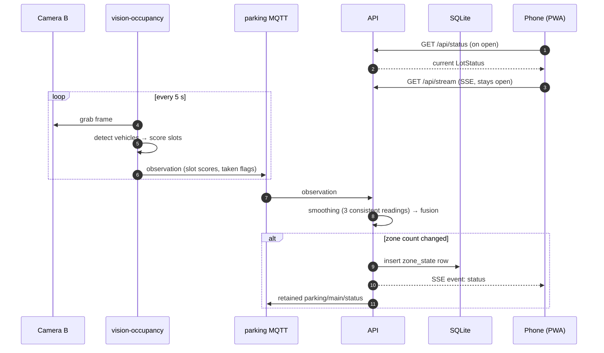
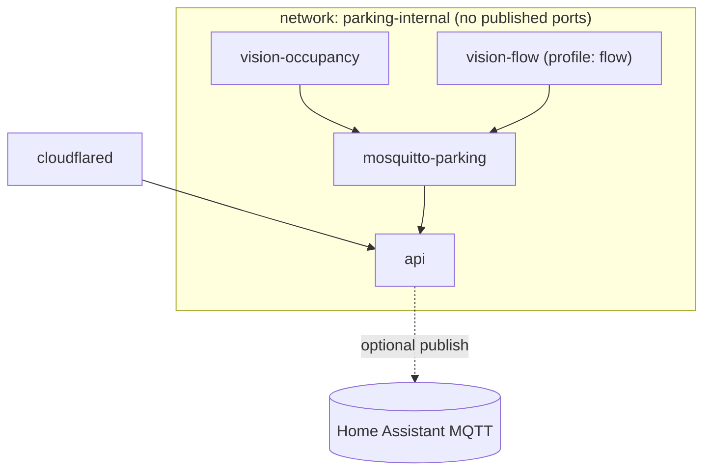

# Architecture

## 1. Components

| Component | Runs where | Responsibility | Talks to |
|-----------|-----------|----------------|----------|
| **vision-occupancy** worker | Pi (or edge box) | Grabs frames from Camera B, detects vehicles, scores each space, publishes results | Camera (RTSP/HTTP) → parking MQTT |
| **vision-flow** worker | Pi (or edge box) | Reads Camera A's sub-stream, detects + tracks vehicles, publishes in/out events | Camera (RTSP) → parking MQTT |
| **parking MQTT broker** | Pi, Docker, internal network only | Message bus between workers and API | workers, API |
| **API** | Pi, Docker | Smoothing, flow counting, fusion into zone counts, SQLite history, REST + SSE, Web Push, admin | parking MQTT, SQLite, phones (through tunnel), push services, home MQTT (optional) |
| **SQLite** | Pi, file in `data/db/` | History, subscriptions, corrections | API only |
| **Tunnel** | Pi, Docker | Public HTTPS hostname for the API without opening router ports | API |
| **Frontend (PWA)** | GitHub Pages | Live screen, notifications settings, stats, admin | API over HTTPS |
| **Home Assistant MQTT broker** (optional) | wherever HA's broker runs | Only used to publish status to Home Assistant | API (publish only) |

## 2. Data flow



Flow camera events follow the same path: `flow` messages → API `FlowCounter` → fusion → SSE.

## 3. Ground rules

1. **Workers never send images** to the API, except a single JPEG an admin asks for (`cmd: snapshot`). Results are small JSON.
2. **The API is the only writer** to SQLite and the only component the internet can reach.
3. **Configuration is file-based** (`config/lot.yaml` + `config/slots/*.json`), committed to git. **Secrets and the lot location come from `.env`** (git-ignored).
4. **Time is UTC** everywhere in storage and payloads (ISO 8601 with `Z`). Only the UI converts to local time.
5. **Pixel coordinates** in slot and line files are relative to the reference image size stored in that file. Workers rescale if the live frame size differs.
6. **Every message has a version field `v`** so payloads can evolve.
7. **Workers are stateless** apart from short-term buffers. All counting state that must survive a restart (flow counts, smoothing results) lives in the API and is persisted.
8. **Fail visible, not silent.** If data is old or a camera is unhealthy, the UI says so (see `stale` and `confidence` in [api.md](api.md#lotstatus)).

## 4. Backend module map (`backend/parking/`)

```
backend/
├── pyproject.toml
├── alembic.ini
├── migrations/                  # Alembic migrations (from Phase 2)
├── parking/
│   ├── __init__.py              # __version__
│   ├── cli.py                   # Typer app: `parking ...` (all commands, see §6)
│   ├── config.py                # pydantic models for lot.yaml, slot/line files, Settings (.env)
│   ├── geometry.py              # polygon/line helpers on top of shapely + numpy
│   ├── messaging.py             # MQTT topic builders + pydantic payload models
│   ├── mqtt.py                  # thin sync (paho) and async (aiomqtt) client helpers with reconnect
│   ├── vision/
│   │   ├── detector.py          # Detection dataclass, Detector protocol, YoloDetector
│   │   ├── occupancy.py         # slot scoring, zone counting
│   │   ├── flow.py              # TwoLineCounter (per-track crossing state machine)
│   │   ├── tracking.py          # wrapper around ByteTrack (via ultralytics)
│   │   ├── motion.py            # MotionGate (MOG2)
│   │   ├── sources.py           # FrameSource protocol + file/folder/snapshot/rtsp sources
│   │   ├── health.py            # black / frozen / blurry frame checks
│   │   ├── shift.py             # camera shift detection vs reference frame (ORB)
│   │   ├── annotate.py          # draw slots, detections, lines, totals on a frame
│   │   ├── bootstrap.py         # propose slots from detections
│   │   └── evaluate.py          # metrics for occupancy and flow
│   ├── workers/
│   │   ├── base.py              # loop, heartbeat, command handling, graceful shutdown
│   │   ├── occupancy_worker.py
│   │   └── flow_worker.py
│   ├── core/
│   │   ├── smoothing.py         # SlotSmoother, CountSmoother
│   │   ├── flow_counter.py      # FlowCounter (clamp, corrections, idempotency)
│   │   ├── fusion.py            # StateStore → LotStatus (confidence, stale, trend, level)
│   │   └── clock.py             # injectable clock for tests
│   ├── db/
│   │   ├── engine.py            # SQLModel engine/session (WAL mode)
│   │   ├── models.py            # tables (see data-model.md)
│   │   └── repo.py              # read/write helpers, aggregation, pruning
│   ├── api/
│   │   ├── app.py               # create_app(): routers, CORS, rate limits, lifespan
│   │   ├── deps.py              # settings, db session, state store, auth dependencies
│   │   ├── sse.py               # Broadcaster (fan-out to SSE clients)
│   │   ├── mqtt_consumer.py     # subscribes to worker topics, feeds core/
│   │   ├── ha_bridge.py         # optional: publish status + discovery to home MQTT
│   │   └── routes/
│   │       ├── public.py        # /healthz, /api/lot, /api/status, /api/stream, /api/history
│   │       ├── push.py          # /api/push/*
│   │       └── admin.py         # /api/admin/*
│   └── push/
│       ├── sender.py            # pywebpush wrapper, expiry cleanup
│       ├── rules.py             # when to notify (on-my-way, schedules, quiet hours)
│       └── scheduler.py         # APScheduler jobs
└── tests/
    ├── unit/
    ├── integration/
    └── fixtures/                # synthetic images and JSON only (public repo!)
```

## 5. Frontend module map (`frontend/src/`)

```
frontend/
├── index.html
├── vite.config.ts               # base: '/parking-app/', PWA plugin (injectManifest)
├── public/icons/                # PWA icons
└── src/
    ├── main.tsx                 # root, HashRouter, i18n init, SW registration
    ├── App.tsx                  # layout: header, bottom nav, routes
    ├── sw.ts                    # service worker: precache + push + notificationclick
    ├── api/
    │   ├── types.ts             # LotStatus, Zone, etc. (mirror of api.md)
    │   ├── client.ts            # fetch wrappers, base URL, admin token
    │   ├── live.ts              # SSE connection manager (reconnect, polling fallback)
    │   └── mock.ts              # fake live data for development without backend
    ├── hooks/
    │   ├── useLiveStatus.ts
    │   ├── useNow.ts            # ticking clock for "updated X s ago"
    │   └── useProximity.ts      # Tier 1 geolocation watcher
    ├── lib/
    │   ├── status.ts            # level thresholds, formatting
    │   ├── geo.ts               # haversine distance
    │   └── push.ts              # subscribe/unsubscribe helpers
    ├── screens/
    │   ├── LiveScreen.tsx
    │   ├── NotificationsScreen.tsx
    │   ├── StatsScreen.tsx      # Phase 7
    │   ├── PrivacyScreen.tsx    # Phase 8
    │   └── admin/               # Phase 7, lazy-loaded
    ├── components/              # BigCount, ZoneCard, StatusBanner, UpdatedAgo, InstallHint…
    ├── i18n/
    │   ├── index.ts
    │   └── locales/en.json
    └── styles/index.css         # Tailwind + design tokens
```

## 6. CLI commands (`parking …`)

| Command | Phase | Purpose |
|---------|-------|---------|
| `parking --version` | 0 | Smoke test |
| `parking models export --model yolo11n-seg --imgsz 640 --format ncnn` | 1 | Download + export weights to `models/` |
| `parking analyze --image PATH --camera ID` | 1 | Analyse one image → JSON + annotated PNG |
| `parking evaluate --images DIR --labels FILE --camera ID [--sweep 0.1:0.6:0.05]` | 1 | Accuracy metrics, threshold sweep |
| `parking bootstrap-slots --image PATH --camera ID --out FILE` | 1 | Suggest slot polygons |
| `parking benchmark --image PATH [--runs 20]` | 1 | Speed per model/format/size |
| `parking worker occupancy --camera ID` | 2 | Run the occupancy worker |
| `parking worker flow --camera ID` | 5 | Run the flow worker |
| `parking api` | 2 | Run the API (uvicorn) |
| `parking db upgrade` | 2 | Apply Alembic migrations |
| `parking record --camera ID --minutes 60` | 5 | Record a test clip |
| `parking evaluate-flow --video PATH --truth CSV --camera ID` | 5 | Flow accuracy on a clip |
| `parking push vapid-keys` | 6 | Generate VAPID keys |
| `parking admin hash-password` | 7 | Argon2 hash for `.env` |
| `parking db prune` / `parking db aggregate` | 7 | Retention + rollups (also scheduled) |
| `parking backup --out DIR` | 8 | Consistent SQLite + config backup |

## 7. Runtime view (Docker Compose)



Details in [deployment.md](deployment.md).
