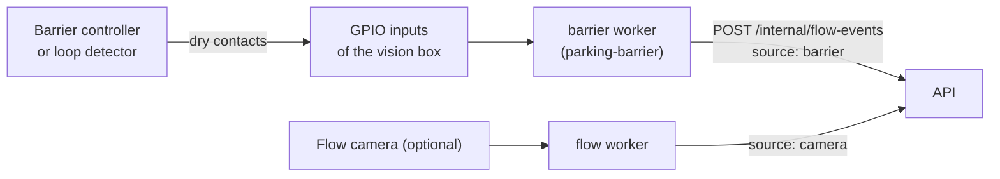

# Barrier / induction-loop integration (P9.3)

Where the lot has a barrier (or loop detectors in the lane), its controller already knows about every car that passes. Its contacts give a near-perfect entry/exit count for a `flow` zone, alone or next to the flow camera.

Nothing here needs a camera. Not built: a vendor's network API (no controller is known yet, §6).

## 1. How it fits



- A barrier is **an entry in `cameras`** with `role: barrier` ([config.md §1](config.md#1-configlotyaml)). It has an id, one `flow` zone and a `source`, like a camera, so its health, the *Cameras* page, `/healthz` and the admin alerts work the same way. It has no detector, no slot or line file and no snapshot.
- The **barrier worker** (`parking worker barrier --camera <id>`, `parking/workers/barrier_worker.py`) reads the contacts, turns them into cars in and out (§2) and sends one flow event per car through the same outbox as the flow worker ([api.md §5.1](api.md#51-workers--api)): nothing is lost while the API can't be reached.
- The events are ordinary `flow` payloads with `"source": "barrier"`, `camera_id` = the barrier's id, `cls: "vehicle"`, `confidence: 1.0` and `track_id` = the car's number since the worker started.

## 2. From contacts to cars (`parking/workers/contacts.py`)

A **contact** is a relay output of the controller: closed while (or briefly when) a car is there. Two ways to read them, `barrier.mode` in lot.yaml:

| Mode | Inputs | Rule |
|------|--------|------|
| `pulse` (default) | `in`, `out` (one of them is enough) | Every **closing** of `in` is one car in, of `out` one car out. Closings of the same input less than `min_gap_ms` (1000) after the last counted one are the same car (contact bounce, a relay that chatters). Use it with separate entry and exit lanes, a controller that gives one pulse per opening, or a two-channel loop detector with direction outputs |
| `pair` | `a`, `b` | Two presence loops one after the other in **one lane used both ways**. A car that comes onto one loop and leaves over the other is counted in the direction it drove (`in_direction: a_to_b \| b_to_a`); one that leaves over the loop it came in on backed out and is not counted. Loops that don't overlap work too: the second loop may follow within `pair_timeout_s` (30) |

- A contact that is already closed when the worker starts is not a new car. In `pair` mode a car standing on one loop at start is taken as coming from that loop; on both, its direction is unknown and it isn't counted.
- Known limits: two cars so close that both loops stay taken between them count as one in `pair` mode; a `pulse` controller that pulses on every opening also counts an opening for a pedestrian or a test. Both show up in the comparison with the camera (§4) or as slow drift, fixed like any flow count ([runbook](../runbook.md#counts-are-drifting-flow-camera)).

## 3. Sources

`cameras[].source` of the barrier:

| Source | What |
|--------|------|
| `gpio:<chip>?in=17&out=27` (or `a=17&b=27`) | GPIO input lines of the machine the worker runs on, through the kernel's GPIO character device (the `gpiod` package, part of the `vision` extra, with its own libgpiod). The numbers are the chip's line offsets: on a Raspberry Pi the BCM numbers, chip `/dev/gpiochip0` (Pi 5 with a current kernel; `gpioinfo` lists them). Options: `active=low` (default: the contact closes the input to GND) or `high`; `bias=pull-up` (default for `active=low`), `pull-down` (default for `active=high`) or `none` (an external resistor); `debounce_ms=30` (done by the kernel) |
| `contacts:<file.csv>?realtime=true&loop=false` | A written or recorded sequence, one `seconds,input,closed\|open` line per edge, `#` comments. For tests and for trying a configuration without hardware. `realtime=false` gives all edges at once; with `loop=true` the file starts over after its last line's time |

- The lines are opened in two steps: the pull resistor first, the edge detection 50 ms later. In one step the kernel's debouncer can start from the level before the pull took hold and then misses the first closing (seen on the dev Pi 5: pins that default to pull-down read "closed" at start and their first car was lost).
- If the contacts can't be opened or read (no such chip, no permission, a line in use, the device gone), the reason is in the worker's log, its health is `down` / `connect_failed`, and it tries again every 10 s. A wrong `source` string or a mode whose inputs the source doesn't have stops the worker at start with the reason.
- **Wiring** ([hardware.md §4.7](hardware.md#47-barrier-contacts-p93)): only potential-free (dry) contacts go straight to the header, between the GPIO pin and GND. Anything that carries a voltage goes through an optocoupler or a relay.

## 4. One source or two (API)

A `flow` zone has a flow camera, a barrier, or both (at most one of each):

- **One of them:** its events move the count. Nothing else changes.
- **Both:** one **counts**, the other is only **compared** with it. By default the barrier counts; `zones[].counted_by: <camera or barrier id>` puts the camera in charge instead.
  - Events of the second source are accepted and stored in `flow_event` with `counted = false`, `applied = false` ([data-model.md](data-model.md#flow_event)). They never touch the count, the confidence or the clamp alert.
  - The zone's freshness follows the counting source only: the second one going down doesn't make the zone stale (it still raises its own *down* alert).
  - **Admin alert `flow_mismatch:<zone>`** ([notifications.md §5.1](notifications.md#51-admin-alerts-p78-p87)): the two sources' net counts (in − out) since the lot-local midnight or the zone's last correction differ by **more than 2 cars** (the Phase 5 drift target) for 2 minutes. The alert names both: `barrier +5 (in 6, out 1), camera +2 (in 3, out 1)`. It is not raised while either source is down or has not reported since the API started, because the cars it missed would be the whole difference.
  - After an outage of one source (or on the day the second one is installed) the two differ by what was missed. A correction of the zone's count, also to the same number, starts the comparison again; so does midnight.
- An event whose `source` doesn't match what lot.yaml says its `camera_id` is (a barrier id with `source: camera`, or the other way round) is rejected with 422, like an unknown camera.

Rules in `parking/config.py` (`flow_sources`, `flow_counter`, `flow_checker`), `parking/core/fusion.py` (`flow_zone`, `counts_flow`), `parking/api/ingest.py`; the alert in `parking/push/admin_alerts.py` (`flow_tallies`, `mismatch_condition`).

## 5. Running it

The worker runs from the `parking-vision` image as the service `barrier` (container `parking-barrier`), behind the Compose profile `barrier`, in the base file and the site file ([deployment.md §4.4](deployment.md#44-a-barriers-contacts-on-the-vision-host-p93)). It has the same hardening, heartbeat healthcheck and autoheal label as the camera workers, fixed small limits (0.25 CPU, 256 MB) and no control port. The GPIO chip is passed in by the opt-in override `docker-compose.barrier.yml`: one device (`BARRIER_GPIOCHIP`, default `/dev/gpiochip0`) and the host's `gpio` group (`GPIO_GID`).

```bash
# try a configuration without hardware (prints the events instead of sending them)
cd backend && uv run parking worker barrier --camera barrier-ramp --print
# on the vision box
cd deploy && echo "GPIO_GID=$(getent group gpio | cut -d: -f3)" >> .env
docker compose -f docker-compose.site.yml -f docker-compose.barrier.yml --profile barrier up -d
docker logs -f parking-barrier        # "contacts open (in, out)", then one line per car
```

`LOG_LEVEL=DEBUG` logs every edge, which is how to see which contact does what when wiring it up.

## 6. Not built, and why

- **A controller's network API.** No barrier or controller is known for this lot, and every vendor's API is different. The contract is already there: anything that can send the `flow` payload with `source: "barrier"` and a health message every 10 s with the worker token is a barrier. A vendor client is one more source in `contacts.py`.
- **Automatic correction** of the camera's count from the barrier (or the other way round). With both installed the more reliable one simply counts; the alert tells an admin when to look.
- A map or picture on the barrier's page in *Admin → Cameras*: it shows the health only (the snapshot area says there is none, as for a camera without `control_url`).

## 7. Tested

- `backend/tests/unit/test_contacts.py`: both decoders (bounce, backing out, loops that don't overlap, start states), the replay file, the `gpio:` string, the GPIO source against a fake `gpiod` (two-step open, edges with the kernel's times, each reason it can't open).
- `backend/tests/unit/test_barrier_worker.py`: replayed contacts to events (print mode and through the outbox), `pair` mode, wrong configuration, GPIO that can't be opened → `down`, then recovers; the CLI.
- `backend/tests/integration/test_barrier.py`: a barrier alone counts its zone (and survives a restart); with both, who counts, what is stored, staleness; `counted_by`; 422 for a wrong `source`; the tallies and the mismatch alert with its texts.
- `backend/tests/unit/test_config.py`, `test_compose_hardening.py`: the lot.yaml rules, the `barrier` service and its override.
- On the dev Pi (no barrier there), 2026-10-10: the worker on two unused header pins (GPIO17/27), the level changed by switching the pins' own pull resistors: in, in, out and a chattering closing counted as 3 in / 1 out in three runs out of three (after the two-step open; before it the first `out` was lost). A throwaway API + the worker on a replayed contact file + camera events sent by hand: results in PROGRESS.md. **Not yet run on a real barrier controller.**
