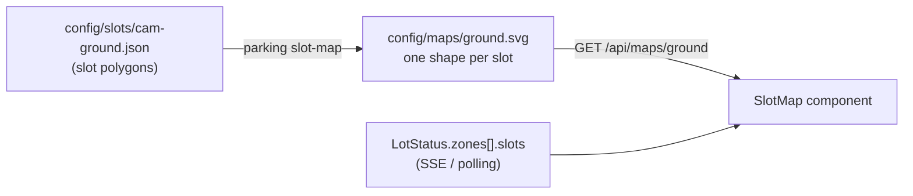

# Slot map (P9.1)

Shows **which** spaces are free, not just how many: a schematic of a `slots` zone on its card of the Live screen, each space coloured from the live status.



The map holds only geometry. The states come from `LotStatus.zones[].slots` ([api.md §1](api.md#lotstatus)), which the app already receives, so the map never needs to be fetched again when a car moves.

## 1. The map file: `config/maps/<zone>.svg`

Committed, like the slot files: it holds no picture of the lot, only shapes.

```xml
<svg xmlns="http://www.w3.org/2000/svg" viewBox="0 0 588.2 1000" data-zone="ground" data-camera="cam-ground">
  <rect id="G01" x="26.1" y="107.4" width="206.3" height="106.2" rx="8.5"/>
  <rect id="G02" x="23.3" y="217" width="210.5" height="108" rx="8.6"/>
</svg>
```

Rules:
- The root is `<svg xmlns="http://www.w3.org/2000/svg">` with a `viewBox`.
- **A slot** is a `rect`, `polygon`, `path`, `circle` or `ellipse` whose `id` is the slot id from the slot file ([config.md §2](config.md#2-slot-file-configslotscamerajson)).
- Anything else that is a plain shape is **decoration** (lanes, an entrance arrow, a label): `line`, `polyline`, `text`, the shapes above without an `id`, and `g` to group or move them. Decoration is drawn as thin outlines and words in the muted colour.
- Only geometry is read: `x y width height rx ry cx cy r x1 y1 x2 y2 points d transform`, plus `font-size` and `text-anchor` on `text`. Colours, styles, classes, scripts, images, links and every other element are **ignored**, so the app decides how a space looks in light and dark mode. A file drawn in Inkscape works as long as its shapes carry the slot ids.
- At most 200 KB (`parking/slot_map.py` `MAX_BYTES`); a bigger file is not served.

lot.yaml names the file on the zone ([config.md §1](config.md#1-configlotyaml)): `map: config/maps/ground.svg`, allowed on `slots` zones only. A zone without `map` has no map, and nothing else changes.

## 2. Making it: `parking slot-map`

```bash
cd backend
uv run parking slot-map --camera cam-ground            # writes the zone's map (default config/maps/<zone>.svg)
uv run parking slot-map --camera cam-ground --check    # compares an existing map with the slot file, exit 1 on a difference
```

Options: `--zone` (default: the camera's first zone), `--out`, `--force` (an existing file is never overwritten without it), `--snap-deg` (default 10), `--gap` (default 0.06).

`build_slot_map()` in `parking/slot_map.py`:
1. Each slot polygon becomes its smallest enclosing rectangle (`shapely` `minimum_rotated_rectangle`): centre, width, height and angle (kept within ±45°).
2. A rectangle turned by less than `--snap-deg` is drawn upright, so hand-drawn corners that are a few degrees off give a tidy grid. Others keep their angle as `transform="rotate(a cx cy)"`.
3. Every rectangle shrinks by `--gap` × the median short side, so neighbours that share an edge in the slot file don't touch.
4. The drawing is scaled so its longer side is 1000 units, with a 20 unit border.

**This is a top-down projection only for a camera that looks straight down** (the sample photo's view): the picture already is the plan. For an angled camera the polygons are in perspective and the generated map would be too. Then draw the map by hand (any SVG editor, rules in §1) and check it with `--check`. A projection from four ground points is not built (not needed for the view that exists).

**When the slots change** (the admin editor, [frontend.md §2.4](frontend.md#24-admin-admin-phase-7-lazy-chunk)): the map is not redrawn by itself. Run `parking slot-map --camera <id> --force` (or edit the hand-drawn file) and commit it. Until then the app stays honest: a shape whose slot is gone is drawn dashed (*No data*), and slots without a shape are counted under the map ("2 spaces aren't on the map"). `tests/unit/test_slot_map.py` fails in CI when the committed map and slot file disagree.

## 3. Serving it: `GET /api/maps/{zone}`

[api.md §2](api.md#2-public-rest-endpoints). The file as stored, `Content-Type: image/svg+xml`, `Cache-Control: public, max-age=300`. Read from disk on every request, so a new file needs no restart. `404 not_found` for an unknown zone, a zone without `map`, a missing file or one over 200 KB.

The answer also carries `Content-Security-Policy: default-src 'none'; style-src 'unsafe-inline'; sandbox` and `X-Content-Type-Options: nosniff`: in production the API and the app share one origin, and an SVG opened directly is a document of that origin, so it must not be able to run anything even if someone puts a script into the file.

Why the API and not the frontend build: the map is the lot's configuration, next to `lot.yaml` and the slot files, and the frontend stays the same build for any lot (it already learns the zones from the API). It also lets the Pages preview show the dev Pi's map.

## 4. Drawing it: `SlotMap` (frontend)

`src/components/SlotMap.tsx`, on the `ZoneCard` of every zone whose status has `slots`; `src/lib/slotMap.ts` parses the file; `getSlotMap()` in `src/api/client.ts` fetches it (`null` on 404).

- The card gets a **Show map / Hide map** button (`aria-expanded`). Closed by default, so the Live screen stays as short as before; the choice is remembered per zone in `localStorage` (`parking.map.open.<zone>`). No button when the zone has no map, the file can't be read or parsed, or it has no slot shapes: the numbers never depend on the map.
- **The file is never inserted as markup.** `parseSlotMap()` reads it with `DOMParser` and keeps only the elements and attributes of §1 (values limited to numbers, letters and `.,()+-%`); the component creates the SVG elements itself.
- Each slot shape: **free** = solid in the `ok` colour, **taken** = the muted colour at 30% opacity, **not in the status** = dashed outline. Free and taken differ in how solid they are, not only in hue. Colours are `currentColor`, so a dimmed card (stale zone, offline) greys the map with the numbers.
- **Tapping** a space outlines it and shows "Space G07: Free" under the map (`role="status"`); tapping it again clears it. Each shape is a `role="button"` with that text as its name, reachable with Tab and pressed with Enter or Space. A legend (Free / Taken) sits under the map.
- The map is at most 24 rem tall and never wider than the card.

**Mock mode** (`VITE_API_BASE=mock`): `mockSlotMap()` in `src/api/mock.ts` builds a map for the mock lot's 40 ground spaces (four rows of ten with two lanes), so the preview without an API shows the feature too.

Texts: `map.*` in the locale files.

## 5. Checked

- Backend: `tests/unit/test_slot_map.py` (layout, gap, snapping, ids, hand-drawn files, the committed map vs the committed slot file), `test_cli.py` (`slot-map` write / `--check` / errors), `test_public_api.py` (the route, its headers and 404s), `test_config.py` (`map` only on `slots` zones).
- Frontend: `src/lib/slotMap.test.ts` (parsing, everything unsafe dropped), `src/components/SlotMap.test.tsx`, `e2e/slot-map.spec.ts` (mock build, 320 px: 40 shapes, as many free ones as the card's number, tap, reload).
- "Matches reality at a glance" (P9.1, on the dev Pi, 2026-10-10): a throwaway API + occupancy worker on the simulated feed, the app built against it and opened in Chromium (390 px, light and dark). Two columns as in the photo; the taken spaces on the map (G01 top left, G09 top right) were the ones the feed's labels say were taken in those frames. On simulated frames of the one sample photo, not on a real camera.
