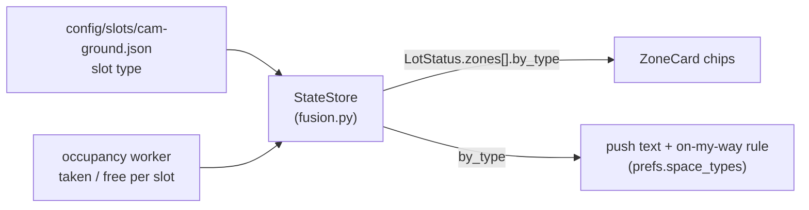

# Special spaces (P9.2)

"2 accessible spaces free", "EV charger free": the spaces that aren't for everyone are counted on their own, next to the zone's number.



## 1. Where the type comes from

Each slot in a slot file has a `type` ([config.md §2](config.md#2-slot-file-configslotscamerajson)): `standard` (the default), `accessible`, `ev`, `motorcycle` or `reserved`. It is set in the slot editor (Admin → camera → *Edit slots* → select a space → *Type*), or by hand in the file. Nothing is detected: the camera can't see a painted symbol reliably, and the type never changes on its own.

The **special types** are the four that aren't `standard` (`SPACE_TYPES` in `parking/messages.py`, `src/lib/status.ts`), always in that order.

## 2. `by_type` in the status

`LotStatus.zones[].by_type` ([api.md §1](api.md#lotstatus)):

```json
"by_type": { "accessible": { "capacity": 2, "free": 1 }, "ev": { "capacity": 1, "free": 0 } }
```

- Only `slots` zones have it; `count` and `flow` zones have no spaces to tell apart and send `null`.
- A type is listed when the zone has at least one such space, so a `slots` zone without special spaces sends `{}`. `standard` is never listed.
- `capacity` = spaces of that type in the zone, `free` = those whose **smoothed** state isn't taken ([vision.md §3](vision.md)). A space without a reading yet counts as free, exactly as in the zone's own count.
- Special spaces are **part of** the zone's `capacity` / `free` / `occupied`; `by_type` is a breakdown, not an addition. So "12 free" on the ground level may include an accessible space most drivers can't use: the chip is what says so.
- There is no confidence or staleness per type: the zone's `stale` and `confidence` cover them (the card dims as a whole).
- A change in `by_type` is a status change even when the zone's count stays the same (an accessible space frees up while a standard one is taken), and so is retyping a space in the editor: both are published at once. No database table stores it; it is derived from the slot states, which are restored at start-up ([data-model.md](data-model.md)).

`StateStore._by_type` (`parking/core/fusion.py`) computes it from the slot files the store already holds.

## 3. In the app

**Zone card** (`src/components/ZoneCard.tsx`, [frontend.md §2.1](frontend.md)): one chip per type the zone has, under the level bar: `Accessible 1 / 2`, `EV charging 0 / 1`. The free number is green when there is one and plain when there is none; the words carry the meaning, the colour only helps. Screen readers get "Accessible: 1 of 2 free". A zone without special spaces has no chip row. A type a newer server sends that this app version doesn't know is skipped.

**Mock data** (the preview without an API): the last two spaces of the mock ground zone are accessible and the two before them have chargers.

## 4. Notifications

`prefs.space_types` ([api.md §2](api.md), a list of special types, default `[]`), set on the Alerts screen under **Special spaces**. The screen lists the types the lot has (from the live status), plus any the device already follows.

For a subscription that follows a type ([notifications.md §4](notifications.md#4-tier-2-im-on-my-way-server-rules-pushrulespy)):

- **Every push names it:** the body gets the free count of each followed type the watched zones have, before the time: `Ground 12 · Underground ≈11 · Accessible 1 · EV charging 0 · 17:05` (`parking/push/payload.py`, summed over the zones in `prefs.zones`). The names are English, like the rest of the push text.
- **On my way:** one more reason to push: a followed type went between "none free" and "some free" in the watched zones (`special_flipped` in `parking/push/rules.py`). Like "became full" it ignores the 2-minute gap, and it counts towards the 6 pushes per window. 2 → 1 free is not a reason.
- The proximity banner and notification (Tier 1, built on the phone) add the same counts.

Not done: an alert of its own for a type outside an on-my-way window ("tell me whenever a charger comes free"). It would need its own cooldown and wording; reminders and on-my-way cover the trip itself.

## 5. Tested

- `tests/unit/test_fusion.py` (counts per type, smoothing, a swap between types with an unchanged count, retyping), `tests/unit/test_push_rules.py` (the on-my-way rule), `tests/integration/test_push_api.py` (the pref, the push text), `test_public_api.py` / `test_admin_editor.py` (over HTTP, after a save in the editor).
- Frontend: `live.test.tsx` (chips), `fixtures.test.ts` (an answer without `by_type` is accepted, a malformed one isn't), `mock.test.ts`, `push.test.ts`, `NotificationsScreen.test.tsx`, `e2e/special-spaces.spec.ts` (light and dark, 320 px).
- On the dev Pi (2026-10-10): a throwaway API + occupancy worker on the simulated feed with a copy of the slot file in which G01/G02 were marked accessible and G09/G10 EV. In every sample of `/api/status` the counts per type matched the taken spaces of the same answer (for example G01 and G09 taken → accessible 1 / 2, EV 1 / 2; G01, G02, G09, G10 taken → 0 / 2 and 0 / 2). The committed slot file marks **no** special spaces: which spaces of the real lot are accessible or have chargers isn't known yet.
