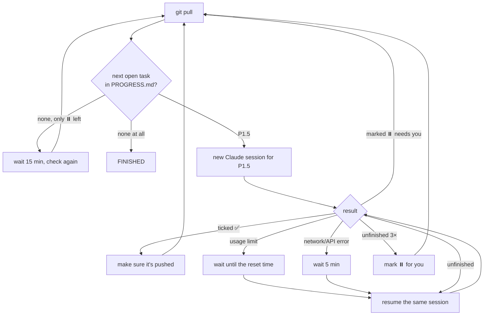

# Agent loop

Runs the plan by itself on the **dev Raspberry Pi**: it takes the next open task from [`PROGRESS.md`](../../PROGRESS.md), gives it to a **fresh Claude Code session**, checks the task was ticked and pushed, then moves on to the next one, until everything is done.

## Commands

```bash
tools/agent-loop/start.sh          # start in the background (tmux session "parking-loop")
tmux attach -t parking-loop        # watch live; leave it running with Ctrl+B, then D
tools/agent-loop/status.sh         # what it's doing now + the last few lines
tools/agent-loop/status.sh -f      # follow the live log
tools/agent-loop/stop.sh           # stop after the current task
tools/agent-loop/stop.sh --now     # stop immediately (the task resumes on the next start)
```

From your phone: [`PROGRESS.md` on GitHub](https://github.com/iulian-redinciuc/parking-app/blob/main/PROGRESS.md) updates after every task, and every task is its own commit (`P1.5: …`).

## How it works



- **One task per session.** Each task starts a new session with the task prompt ([task-prompt.md](task-prompt.md)) and the loop's rules ([rules.md](rules.md)).
- **Usage limits.** When your Claude plan's limit is reached, the loop reads the reset time from the error message, or checks again every 30 min if it can't. It then **resumes the same session**, so no context is lost.
- **Interruptions.** If the Pi reboots or you stop it with `--now`, the next `start.sh` resumes the interrupted task's session.
- **Tasks only you can do** (photos, hardware, accounts, a domain, answers to open questions): the session marks them `⏸️ … (needs: …)` and lists them under **Waiting on Iulian** in PROGRESS.md, and the loop moves on to the next task it *can* do. To unblock a task, provide what it needs, then **delete the `⏸️ ` from its line** (on the Pi or directly on GitHub). The loop pulls changes before every task and picks it up again.
- When only blocked tasks are left, it checks again every 15 minutes. When everything is ticked, it stops.

## Where things are

| What | Where |
|------|-------|
| Status | `~/.parking-loop/status.txt` |
| Live log (current task) | `~/.parking-loop/logs/current.log` |
| Full log per task | `~/.parking-loop/logs/<date>-<task>.log` |
| Loop history | `~/.parking-loop/loop.log` |
| A task's full conversation | `cd ~/workspace/parking-app && claude --resume <session id>` (the id is in the status and the log) |

Logs live outside the repo, so they're never committed.

## Settings (environment variables for `start.sh`)

| Variable | Default | Meaning |
|----------|---------|---------|
| `TASK_TIMEOUT` | `3h` | Max time for one session run |
| `MAX_ATTEMPTS` | `3` | Session runs per task before it's marked ⏸️ |
| `IDLE_POLL_S` | `900` | How often to re-check when only blocked tasks remain |
| `LIMIT_FALLBACK_S` | `1800` | Re-try interval when a limit's reset time can't be read |
| `CLAUDE_MODEL` | (your default) | Model for the sessions |

## Important

- Sessions run with **all permission prompts skipped** (`--dangerously-skip-permissions`), so nobody has to approve commands. [rules.md](rules.md) limits them: repo only, no other Docker containers or services on the Pi, no secrets in git, no force-push. They're instructions, not a sandbox, so check the commits now and then.
- **Don't edit the repo yourself while the loop is running.** Stop it first, or edit only `PROGRESS.md` on GitHub (it's pulled before each task).
- Every session uses your Claude plan's usage.
